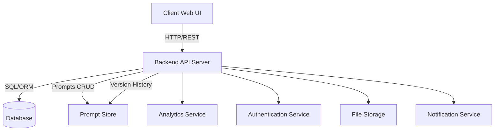

# Architecture Overview

This document describes the high-level architecture of the promptOps system.

## Component Diagram

## Description
- **Client Web UI:** The browser-based interface for end users.
- **Backend API Server:** Serves API requests, business logic, and authentication.
- **Prompt Store:** Core logic and persistent storage for all prompts and their versions.
- **Database:** Stores user & system metadata.
- **Analytics Service:** Processes and summarizes prompt usage statistics.
- **Authentication Service:** Manages user sessions, tokens, and permissions.
- **File Storage:** Stores file attachments or exported prompts.
- **Notification Service:** Sends alerts for prompt changes, sharing, and collaboration.